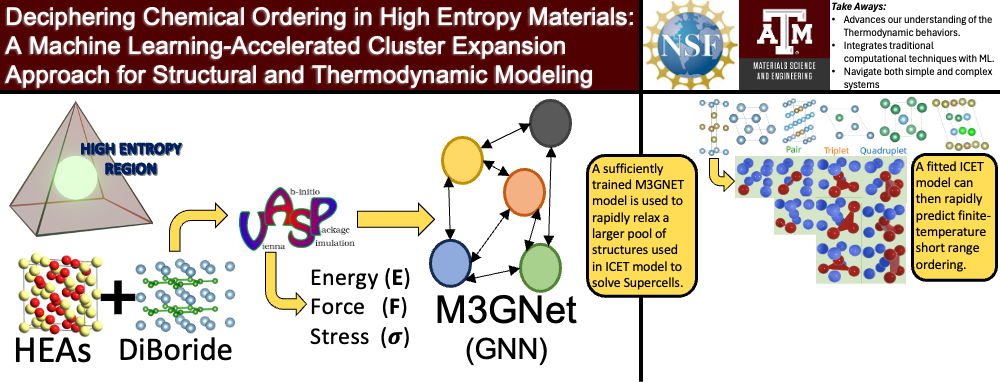
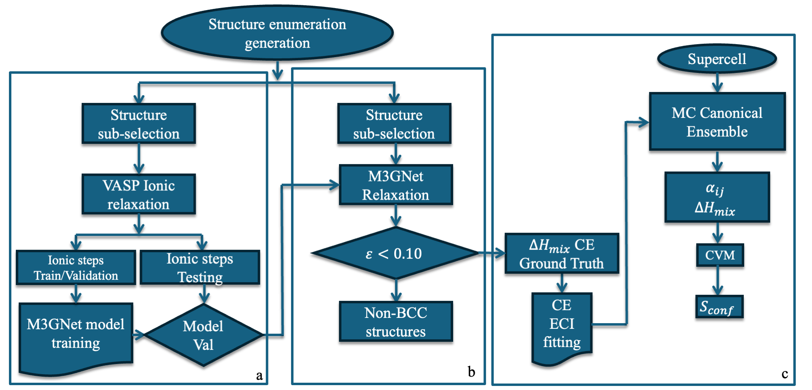

DFT TOOLSET for HT calculation of alloy spaces.

Structure generation, SQS grid space generator, and HT DFT scheduler. 

HT DFT scheduler:

Creates a structure space for a parent lattice space, calculates via DFT and then train matgl model:

The model is extrapolated to Canonical Monte-Carlo simulations to calculate the multicomponent SROs at finite temperatures:

